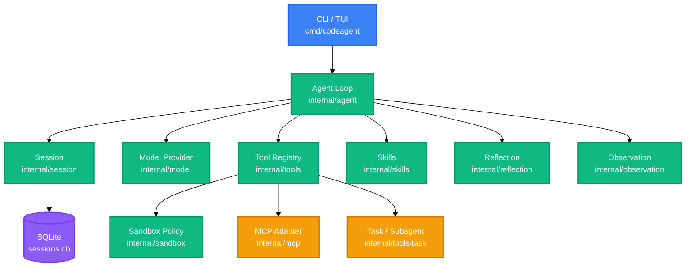

<!-- BEAUTIFIED -->
<!-- AUTO-GENERATED -->
<h1 align="center">CodeAgent</h1>

<p align="center">
  <strong>An AI-native coding agent runtime — the model decides, the runtime enforces.</strong>
  <br />
  <em>CLI · TUI · macOS GUI · iOS · Server — one runtime, every surface</em>
</p>

<p align="center">
  <a href="#quick-start"></a>
  <a href="LICENSE"></a>
</p>

<p align="center">
  
  
  
  
  
</p>

---

## Features

| Feature | Description |
|---|---|
| **Uniform agent loop** | Model → tools → feedback. No workflow state machine. Adding a tool requires only registration, not loop edits. |
| **Three-layer tool system** | Text (`list_files`, `read_file`, `grep`), Structure (`edit_file`, `apply_patch`, `git_diff`), Semantics (`project_graph`) plus policy-gated shell (`run_command`). |
| **Policy-gated execution** | Every command classified as allow / confirm / block. Quoted arguments are data, not syntax. No shell interpreter smuggling. |
| **Context engineering** | `CODEAGENT.md` project memory at session start. SQLite persistence with LLM-driven compaction. Token-aware budget per model. |
| **Progressive disclosure via Skills** | `load_skill` tool pulls guidance on demand. Only the L1 index lives in the system prompt. Model loads what it needs, never auto-injected. |
| **Multi-surface** | TUI workspace, interactive REPL, one-shot `run`/`ask`/`goal`, runtime server with WebSocket agent-wire protocol, and [AgentKit](https://github.com/tuxi/AgentKit) — a native SwiftUI GUI for macOS and iOS that embeds CodeAgent as an on-device runtime. |

## Quick Start

### Prerequisites

- Go 1.25+
- An API key for a model that supports function calling

### Install

```bash
go install ./cmd/codeagent
cp config.example.yaml config.yaml
```

### Configure

```bash
export DEEPSEEK_API_KEY="..."
```

### Run

```bash
# TUI workspace (default)
codeagent

# REPL with a specific model
codeagent --model qwen repl

# One-shot task
codeagent run "explain this project"
```

Sessions persist per-project to `.codeagent/sessions.db`. List them with `codeagent sessions`, resume with `codeagent resume <id>`, or switch inside the REPL with `/resume`.

## Usage

### Interactive REPL

```bash
codeagent repl
> explain how RunTurn works
> /models
  deepseek
* deepseek-pro
  glm
  qwen
> /use glm
switched to glm (glm-5.1)
> /resume
  [1] 20260616-101500-a1b2c3d4  model=glm-5.1  msgs=42
Select a number to resume:
```

### Goal mode (headless, CI-compatible)

```bash
codeagent --auto goal "fix the failing test in internal/agent/loop_test.go"
# exit code 0 = achieved, others distinct by outcome (blocked, errored, budget)
```

### Serve mode

```bash
codeagent serve 127.0.0.1:8797
# HTTP + agent-wire WebSocket protocol for client integrations
```

### Subagent trace

```bash
codeagent tasks                  # list delegations
codeagent task-trace <id>        # replay what the subagent did
```

## Architecture



The loop (`internal/agent`) is business-agnostic. It assembles context, calls the model with tool schemas from the Registry, gates each call through the policy layer, feeds results back. Skills, observation, reflection, and subagents plug into nil-safe interfaces — the loop never changes.

## Configuration

Configuration lives in `config.yaml` at the workspace root and in Claude-compatible `.mcp.json` files for MCP servers.

### Models

| Field | Description | Default |
|---|---|---|
| `default_model` | Model name used when `--model` is not set | deepseek-pro |
| `models.<name>.provider` | `openai` or `ollama` | — |
| `models.<name>.base_url` | API base URL | — |
| `models.<name>.model` | Wire model name | — |
| `models.<name>.api_key_env` | Environment variable holding the API key | — |
| `models.<name>.context_window` | Max context in tokens; sizes compaction threshold | 128000 |
| `models.<name>.input_price_per_million` | Cost per 1M input tokens (for `stats`) | — |
| `models.<name>.cache_input_price_per_million` | Cost per 1M cached input tokens | — |
| `models.<name>.output_price_per_million` | Cost per 1M output tokens (for `stats`) | — |

### Agent

| Field | Description | Default |
|---|---|---|
| `agent.max_steps` | Hard step limit per turn | 32 |
| `agent.compact_ratio` | Fraction of context_window at which compaction fires | 0.75 |
| `agent.subagent_model` | Model for read-only `task` subagents (cheaper fallback) | — |

### Supported models

OpenAI-compatible providers: DeepSeek, Qwen (DashScope), GLM. Local models via Ollama native protocol or OpenAI-compatible endpoint (vLLM, llama.cpp, LM Studio).

## Project Structure

```
cmd/codeagent/         CLI entry point (repl, tui, serve, goal, stats, trace)
internal/
├── agent/             Loop driver (thin) — turn execution, plan mode, hooks
├── session/           Context assembly, token accounting, compaction, SQLite store
├── model/             Provider abstraction (OpenAI, Ollama, DeepSeek) + resilient retry
├── tools/             Tool registry + implementations (filesystem, git, shell, search, web, task)
├── sandbox/           Command policy classification (allow / confirm / block)
├── skills/            Skill registry + load_skill tool + plugin marketplace
├── mcp/               MCP client — stdio/HTTP/SSE transport, tool wrapping
├── observation/       Tool result classification (ok, compile/test/lint failure, salient lines)
├── reflection/        Post-turn self-check (unverified mutations, paper-over detection)
├── hooks/             Pre/post-tool shell hooks (deterministic, config-driven)
├── conversation/      Agent-wire protocol, runtime server, WebSocket transport
├── server/            HTTP mux, wire encoding, control messages, job streaming
├── runtime/           Runner, workspace, registry builder, subagent spawning
└── ui/                Console renderer, diff formatting, terminal helpers
pkg/agentapi/          Public API types
skills/                Built-in skills (code-review, verify-change, git-commit, etc.)
mobile/                iOS embedding support
docs/                  Design docs and protocol specifications
```

## Tech Stack

| Layer | Technology | Purpose |
|---|---|---|
| Language | Go 1.25 | Entire runtime |
| Storage | SQLite (modernc.org/sqlite) | Session persistence, event store, request log |
| TUI | BubbleTea + Lipgloss | Terminal workspace |
| Version control | go-git | Git operations, diff parsing |
| MCP | modelcontextprotocol/go-sdk | External tool server integration |
| WebSocket | coder/websocket | Agent-wire protocol transport |
| Workflow | Flux engine | Goal-based multi-step DAG execution |
| LLM providers | OpenAI-compatible + Ollama native | DeepSeek, Qwen, GLM, local models |

## Contributing

1. Fork the repository.
2. Create a feature branch (`git checkout -b feat/amazing`).
3. Commit your changes following [Conventional Commits](https://www.conventionalcommits.org/).
4. Push and open a Pull Request.

Built-in skills provide guidance for contributing code: `verify-change` for safe edits, `code-review` for structured review, and `git-commit` for commit conventions.

## License

[MIT](LICENSE)
